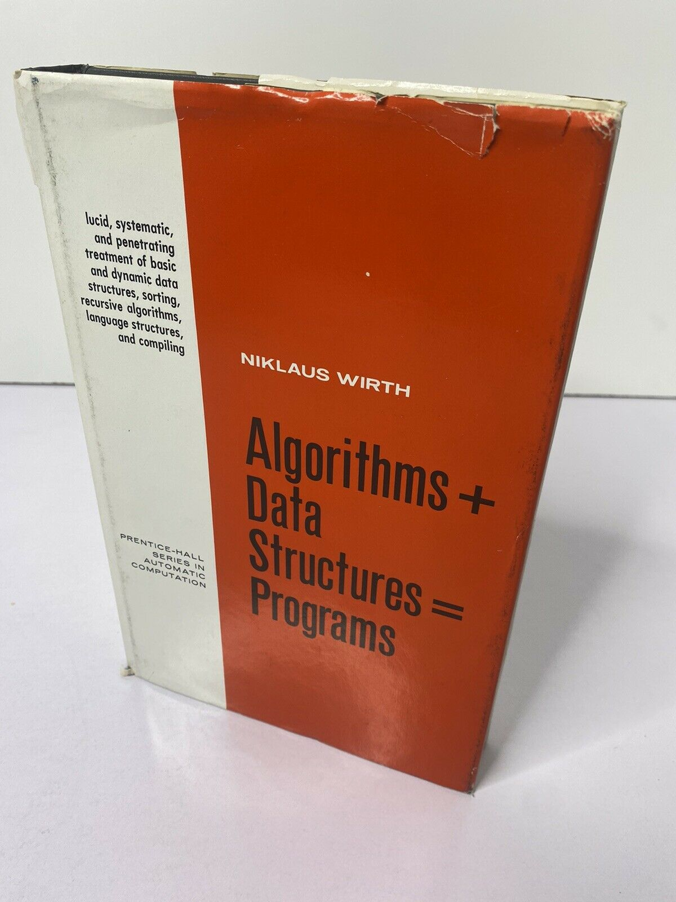

## Why OOP!?

Back at home I have this book by Niklaus Wirth called 

`Algorithms + Data Structures = Programs`

<!---  --->

Indeed any program is data and actions on data. We don't need a runtime for data alone, we could keep it in a text or 
binary file. Actions without input and output is equally dumb.

Now let's get a definition for OOP & object in OOP. Wiki says:

> Object-oriented programming (OOP) is a programming paradigm based on the concept of "objects", which can contain data and code: data in the form of fields (often known as attributes or properties), and code, in the form of procedures (often known as methods).

So what's the difference between objects and programs. First, there is no single benefit of OOP, it's rather a set of
nice features put together that makes OOP useful for coding.

### Intro to abstraction/encapsulation. (10 min)

The key concept in programming is abstraction. Abstraction means structure and hierarchy.
A problem has an inner structure and the solution has an inner structure.
Once the discrete layers of the program are defined, we need to separate them.

Separation into objects and separation of the public/private within the object.

Encapsulation is the technique of bundling data & methods together.
Thus we hide the inner complexity of the program form the client code.

Data hiding is the technique of restricting access to the encapsulated object members. It's intent is to clearly separate
implementation from interface(s), enforce the use of the latter. This way the client code is safeguarded from violating
the abstraction boundaries, coupling with implementation code. Backward compatibility throughout versions for the client
code and freedom of refactoring the implementation in library code.

The goal is not security of the code, but the safety of coding.

### Class join the party

Class-based OOP

### Inheritance (10 min)

- Identity. Building a hierarchical type system.
- Implementation. Reusing the code.
- Interfaces. Looking the same to the outside.

Multiple inheritance.

When calling a method we need to know which inherited method is being called. Furthermore, when calling super method
we need to know which parent method is called.

The series of super methods in linear, it matches the series of parent classes in single inheritance.
With multiple inheritance though we get 2D inheritance graph but the MRO still needs to be linear.
We need to linearize/walk the parents graph. MRO. C3

Diamond problem, mixins, composition.
Bike example: frame + wheels + brake, customizing features at runtime. Type safe at compile time.

### Polymorphism (15 min)

Reusing the interface.

### Native interfaces (code sugar) (20 min)

##### magic dunder methods
- iterator
- str, repr, format
- arithmetic (Vector example, refactor from earlier version)
- operator overloading via overriding

### Cohesion/encapsulation & coupling/data-hiding

Develop intuition for object boundaries.

